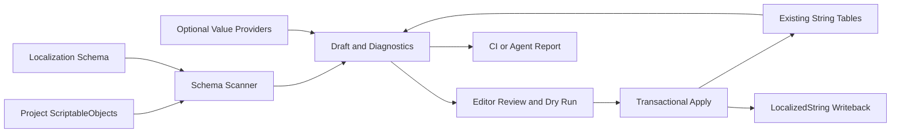

# 改造方向与路线图

## 结论

本项目应定位为：

> 基于官方 Unity Localization 的 Schema 驱动本地化资产生成与验证工具，并提供开放 Agent Skill 自动化工作流；Codex plugin 是其中一个平台适配与分发入口。

它不替代 Unity Localization 的运行时系统，也不在核心包中绑定某个翻译服务。核心价值是把项目中的 `ScriptableObject` 数据安全、稳定、可审查地映射到官方 `StringTableCollection`。

## 产品原则

1. **扩展官方包，而非重造运行时**：复用 `LocalizedString`、String Tables、Smart Strings、CSV/XLIFF/Google Sheets 等官方能力。
2. **Schema 优先**：核心代码不能引用 Mimic 或其他游戏的类型、枚举、目录、表名和术语。
3. **预览优先**：扫描和验证默认只产生草稿；用户确认 diff 后才修改资产。
4. **确定性优先**：key 必须可预测、可迁移、可检测冲突，不能默认依赖易漂移的数组序号。
5. **人工与自动化共用内核**：Editor UI、Agent Skill、CI batchmode 和平台适配器使用同一套扫描、诊断和 Apply 服务。
6. **AI 可选**：AI 只作为 value provider；生成结果仍须经过草稿、校验和人工审阅。

## 目标工作流



扫描阶段不得修改项目资产。Apply 前必须重新验证草稿，避免用户审阅后源资产或表内容已经变化。

## Schema v1 方向

Schema 是公开、稳定的配置契约，至少需要表达以下概念：

```text
sourceType
sourceFolders
identityPath
tableCollection
requiredLocales
targets[]
keyTemplate
updatePolicy
validationRules
terminologyRules
```

每个 target 至少包含：

- `propertyPath`：支持顶层字段和 `bonuses[].description` 等嵌套字段。
- `targetId`：稳定语义名称，例如 `name`、`active-description`。
- `elementIdPath`：嵌套集合元素的稳定身份字段。
- `keyTemplate`：例如 `{sourceId}.{targetId}` 或 `{sourceId}.{targetId}.{elementId}`。
- `required`：字段或翻译是否必需。
- `placeholderContract`：允许的 Smart String 参数。
- `updatePolicy`：保留、补缺或覆盖现有翻译。

复杂游戏条件不应演化为难以维护的表达式 DSL。需要业务判断时，通过项目适配器或 provider 接口扩展。

## 模块划分

### Schema 与扫描

- 解析和验证 schema。
- 使用 `AssetDatabase` 查找源资产。
- 使用 `SerializedObject` / `SerializedProperty` 支持 public 字段和 private `[SerializeField]` 字段。
- 读取现有 `LocalizedString` 引用、已有 key 和 locale 文本。
- 只生成 `LocalizationDraftEntry`，不直接写入。

草稿条目建议包含：

```text
sourceAsset
propertyPath
sourceIdentity
targetId
suggestedKey
existingKey
localeValues
changeKind
diagnostics
enabled
```

### Key 策略

默认格式建议为：

```text
{sourceId}.{targetId}
{sourceId}.{targetId}.{elementId}
```

嵌套集合缺少稳定 ID 时可以暂时使用 index，但必须产生 `UnstableKey` 诊断；CI strict 模式可将其视为错误。Schema 还应支持 legacy aliases、rename preview、字符规范化和 collision policy。

### 验证

首个可用版本必须覆盖：

- identity 或 key 为空、重复或非法。
- 同一 key 被多个资产或字段占用。
- required locale 缺表或缺值。
- `LocalizedString` 指向错误的 collection 或失效 entry。
- schema property path 失效。
- 嵌套元素缺少稳定 ID。
- placeholder 集合不一致或 Smart String 语法无效。
- 即将覆盖已有翻译。
- orphan table entry 报告，初期只报告、不自动删除。

统一诊断模型应包含 `severity`、`code`、`message`、`asset`、`propertyPath`、`locale`、`key` 和 `suggestedFix`，以便 Editor、CI 与不同 Agent 客户端共用。

### Apply

Apply 服务负责：

- Apply 前重新扫描关键状态并拒绝过期草稿。
- `Undo.RecordObjects`。
- 创建或复用 Shared Table key ID。
- 按 update policy 写入各 locale 表。
- 回写 `LocalizedString`。
- `SetDirty`、保存与刷新资产。
- 输出结构化变更报告。

更新策略至少包括：

- `PreserveExisting`
- `FillMissing`
- `Overwrite`

默认使用 `PreserveExisting` 或 `FillMissing`。任何覆盖都必须在 diff 中明确显示。

### 扩展接口

建议保持少量、职责单一的扩展点：

```csharp
ILocalizationSourceProvider
ILocalizationValueProvider
ILocalizationKeyStrategy
ILocalizationValidator
ILocalizationApplyHook
```

项目专属扫描条件、默认文案、AI 翻译、术语检查和特殊 key 规则通过这些接口接入。核心包不保存 API key，也不依赖具体 AI SDK。

### Agent 互操作与平台适配

自动化能力分为三层：

1. **平台无关 Unity 内核**：schema、扫描、诊断、draft、diff 和 Apply 服务提供确定性行为，并通过 Editor API、batchmode/CLI 或可选 MCP 入口暴露结构化结果。
2. **共享 Agent Skill**：`skills/unity-localization-assistant/SKILL.md` 及其 `references/` 保存工作流、安全边界和输入输出契约，遵循开放 Agent Skills 格式，不绑定某一模型或客户端。
3. **平台薄适配层**：Codex plugin、`agents/openai.yaml` 以及其他客户端的安装或发现配置只处理分发、展示、调用和能力声明，不复制业务规则。

“跨 Agent 可用”指兼容 Agent Skills 格式且具备所需 Unity 工具和权限的客户端。Skill 本身不授予文件、网络或 Unity Editor 访问能力；客户端缺少必要能力时必须降级为只读分析或明确的人工交接。共享规则应只有一个规范源，避免为不同 Agent 复制多份 `SKILL.md` 后产生漂移。

## 计划中的包结构

```text
Packages/com.siyan.unity-localization-assistant/
├─ Editor/
│  ├─ Schema/
│  ├─ Scanning/
│  ├─ Drafts/
│  ├─ Validation/
│  ├─ Applying/
│  ├─ UI/
│  └─ Integrations/UnityLocalization/
├─ Tests/
│  └─ Editor/
├─ Samples~/
│  └─ GenericItemCatalog/
├─ Documentation~/
├─ package.json
├─ README.md
└─ LICENSE.md
```

第一阶段保持 Editor-only，不引入新的运行时组件；用户项目运行时继续只依赖官方 Unity Localization。

## 分阶段路线图

### 阶段 0：契约与边界

- 定稿 schema v1 和诊断模型。
- 定义 key 稳定性、冲突和更新策略。
- 用行为测试描述 Mimic 原型中可复用的扫描、草稿和写表行为。
- 明确不复制 Mimic 类型、术语、生产内容和第三方资产。

### 阶段 1：通用最小闭环，目标 `0.1.0`

- 支持一种任意 `ScriptableObject` 源类型。
- 支持多个搜索目录、顶层字段和嵌套 `LocalizedString`。
- 支持多 locale、稳定 key、草稿、diff 和 dry-run。
- 支持 duplicate key、required locale 和 placeholder 校验。
- 实现事务式 Apply 与引用回写。
- 提供完全虚构的 Generic Item Catalog Sample。
- 增加 schema、key、validation、Apply 的 Editor tests。
- 在 Unity 2022.3 干净项目中完成导入、编译和测试。

验收条件：Sample 不引用任何 Mimic 类型或资产，能够独立完成扫描、预览、写表和引用回写。

### 阶段 2：生产可用性，目标 `0.2.0`

- 批量运行多个 schema。
- 嵌套元素稳定 ID 和 legacy key migration。
- orphan entry 与跨 schema 冲突报告。
- JSON/Markdown 报告和 batchmode 命令。
- schema Inspector、创建向导和更完整的 Smart String 解析。
- 增加 Unity 6 兼容测试。

### 阶段 3：自动化生态，目标 `0.3.0`

- 开放 Agent Skill 读取 schema、解释诊断并准备草稿。
- Codex plugin 提供首个经过验证的平台适配与分发入口，并为其他 skills-compatible 客户端记录安装和能力要求。
- batchmode/CLI 输出稳定的 JSON diagnostics、draft 和 diff，供不同 Agent 客户端共用。
- 稳定的 value provider 接口。
- 可选 AI provider、术语表、翻译缓存和增量更新。
- 成本预估、重试与速率限制。
- AI 结果仍必须通过 draft/diff，不默认直接覆盖表。

## 接下来开发计划

以下计划是从当前 scaffold 到首个可用 `0.1.0` 的执行顺序。后续任务依赖前序公开契约，不建议并行设计多套模型后再合并。

### 里程碑 A：建立可测试的包骨架

任务：

1. 创建 `Editor`、`Tests/Editor` 和 `Samples~` 所需 asmdef。
2. 将 package 根补齐 `LICENSE.md`、`.meta` 和 Sample manifest 配置。
3. 建立最小 Unity 2022.3 测试工程或 CI fixture。
4. 增加 clean import、compile 和 EditMode tests 工作流。

交付物：

- 可被 Unity 2022.3 通过 Git URL `?path=/Packages/com.siyan.unity-localization-assistant` 导入的空功能包。
- 至少一个能够在本地和 CI 中执行的占位 EditMode test。

验收条件：

- 干净项目导入后 Console 无编译错误。
- package、Sample、测试程序集边界正确。
- CI 能在失败测试时阻断合并。

### 里程碑 B：定稿 Schema 与领域模型

状态：已于 2026-07-18 实施。Schema v1 Asset、规范化 Definition、领域模型、稳定诊断、配置读取测试和 `docs/schema-v1.md` 已完成；Unity 2022.3.62f3 batchmode 共 19 个 EditMode tests 通过。

任务：

1. 定义 schema v1 的序列化模型和版本字段。
2. 定义 `LocalizationDraftEntry`、`Diagnostic`、`ChangeKind` 和 `UpdatePolicy`。
3. 定义 source identity、target identity、nested element identity 和 key template 规则。
4. 定义 schema 解析、字段缺失、版本不支持和无效模板诊断。
5. 为 schema parsing、升级边界和错误诊断添加测试。

交付物：

- 可创建和序列化的 schema asset。
- 不依赖 Unity Localization 写操作的纯领域模型。
- `docs/schema-v1.md` 配置参考。

验收条件：

- schema 可以表达一个完全虚构的 Item Catalog。
- schema 中不出现 Mimic 类型、表名、locale、路径或术语。
- 错误配置产生稳定的诊断 code，而不是直接抛出未处理异常。

### 里程碑 C：实现只读扫描与草稿生成

状态：已于 2026-07-18 实施。支持任意 `ScriptableObject` source type 解析、按 `sourceFolders` 的确定性资产发现、顶层/private `[SerializeField]`/嵌套集合属性遍历、现有 `LocalizedString` key 与 locale value 读取，以及不修改资产的 `LocalizationDraftEntry` 生成。相关 EditMode tests 覆盖失效路径、确定性顺序和 dry-run 不变性。

任务：

1. 通过类型名解析任意 `ScriptableObject` 类型。
2. 按配置目录查找并稳定排序源资产。
3. 通过 `SerializedObject` 遍历顶层和嵌套字段。
4. 支持 private `[SerializeField] LocalizedString`。
5. 读取现有 table reference、entry reference、key 和 locale value。
6. 生成草稿与变更类型，但不修改任何资产。

交付物：

- `SchemaScanner`。
- `LocalizedReferenceResolver`。
- Generic Item Catalog Sample 的只读扫描测试。

验收条件：

- 连续扫描同一项目得到确定性相同的草稿顺序和 key。
- dry-run 前后项目资产内容完全不变。
- 顶层、嵌套数组和 private serialized field 都有测试覆盖。

### 里程碑 D：实现 key 与验证引擎

状态：已于 2026-07-18 实施。提供确定性 key 展开与字符规范化、全扫描 ownership 索引、结构化验证报告，以及 identity、key 冲突、引用、required locale、placeholder parity 和集合 identity 诊断。Schema v1 未定义 legacy alias 字段，因此本阶段以 `RenameKey` 草稿提供 rename preview，不隐式升级 schema 或删除旧 key。

任务：

1. 实现稳定 key template 和字符规范化。
2. 建立全扫描范围的 key ownership 反向索引。
3. 实现 duplicate key、identity、property path 和 required locale 验证。
4. 实现 Smart String placeholder parser 与 parity 验证。
5. 对缺少 `elementIdPath` 的嵌套集合产生稳定性诊断。
6. 支持 legacy alias 和 rename preview，但暂不自动删除旧 key。

交付物：

- `LocalizationKeyService`。
- `LocalizationValidationService`。
- 结构化诊断报告。

验收条件：

- 冲突、缺表、缺值、失效引用和 placeholder 不一致均有自动化测试。
- 所有可能覆盖现有翻译的操作在 Apply 前均产生可见 diff 或诊断。

### 里程碑 E：实现事务式 Apply

状态：已开始规划。工作拆分、关键契约、依赖顺序和验收矩阵见
[`milestone-e-transactional-apply.md`](milestone-e-transactional-apply.md)。

任务：

1. 实现 `PreserveExisting`、`FillMissing` 和 `Overwrite`。
2. 使用 Shared Table Data 创建或复用 key ID。
3. 写入所有配置 locale，并回写 `LocalizedString`。
4. 支持嵌套 struct/array 元素的 serialized property 写回。
5. 集成 Undo、dirty、save、refresh 和 Apply 后报告。
6. Apply 前检测 stale draft，拒绝基于过期状态写入。

交付物：

- `LocalizationApplyService`。
- Apply/Undo/重复执行幂等性测试。

验收条件：

- Apply 后表值与引用正确，Undo 可恢复。
- 同一草稿重复 Apply 不产生额外 key 或无意义变更。
- 默认策略不覆盖已有非空翻译。

### 里程碑 F：完成 Editor 工作流

任务：

1. 实现 schema 选择、Scan、Rescan、过滤和 Apply 界面。
2. 按 source asset、target、locale 展示旧值、新值和诊断。
3. 支持逐条启用、批量启用和仅应用无错误条目。
4. 错误阻断 Apply，警告需要显式确认。
5. 提供诊断定位到源资产和字段的操作。

交付物：

- 通用 Localization Assistant EditorWindow。
- Generic Item Catalog 的完整演示流程。

验收条件：

- 新用户可只根据 Sample README 完成 schema 创建、扫描、审阅和 Apply。
- UI 中不存在 Mimic 专属按钮、TargetKind 或文案生成逻辑。

### 里程碑 G：发布 `0.1.0`

任务：

1. 完成根 README、package README、schema reference、故障排查和限制说明。
2. 使用开放 Agent Skills 校验器验证共享 skill，并验证 Codex plugin manifest 与 OpenAI 元数据。
3. 在干净 Unity 2022.3 项目导入 package 和 Sample。
4. 运行全部 EditMode tests、敏感信息检查和第三方归属检查。
5. 建立首个提交、版本 tag 和 GitHub release。

发布门槛：

- 所有阶段 1 验收条件通过。
- 无 Mimic 生产数据、GUID、固定类型或第三方 Asset Store 内容进入仓库。
- README 中的功能声明均可由 Sample 和自动化测试复现。

## 建议的首批 GitHub Issues

里程碑 A–D 已完成，不再为历史工作补建未关闭 Issue。首批公开 Issue
从里程碑 E 开始，并按
[`milestone-e-transactional-apply.md`](milestone-e-transactional-apply.md)
拆分为 Apply plan/fingerprint、Unity Localization adapter、引用回写、事务边界、
安全测试和操作文档；后续分别归入 Editor workflow 与稳定 `v0.1.0` 里程碑。

## Mimic 原型迁移映射

| Mimic 原型职责 | 新模块 |
| --- | --- |
| `DraftRow` | `LocalizationDraftEntry` |
| `ScanDraft()` | `SchemaScanner` |
| 读取已有 key/reference | `LocalizedReferenceResolver` |
| `ApplyEnabledRows()` | `LocalizationApplyService` |
| `AssignReference()` | `SerializedPropertyReferenceWriter` |
| placeholder 检查 | `PlaceholderParityValidator` |
| 硬编码术语表 | 项目级 terminology 配置 |
| `Suggested*Zh/En` | Mimic 专属 value provider，不进入核心 |
| `TargetKind` switch | schema target definitions |

迁移应采用“根据行为重写通用实现并补测试”的方式，不能整体复制源文件。

## 非目标

- 不替代 Unity Localization 的运行时 API。
- 不重新实现官方 CSV、XLIFF 或 Google Sheets 导入导出。
- 不把 Mimic 的数据模型变成核心 schema。
- 不默认自动删除表项或覆盖翻译。
- 不在核心包内绑定 OpenAI、Gemini、DeepL 或其他供应商。
